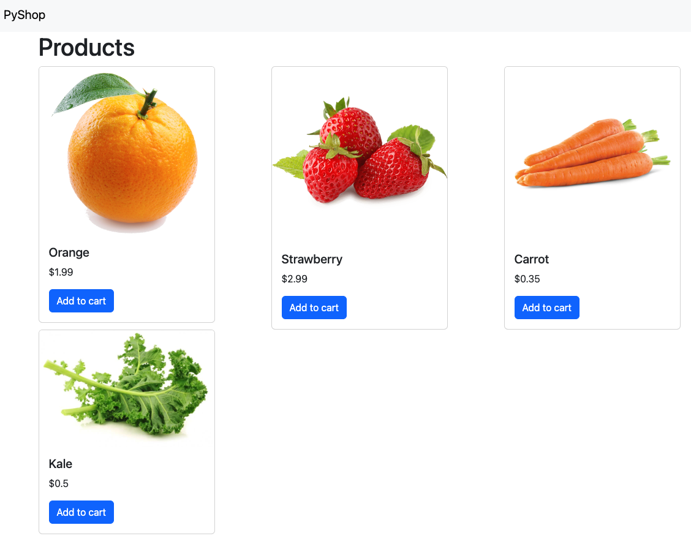

# 🛍️ PyShop

An e-commerce web application built with Django and Python.


## 📸  Snapshots


## ✨ Features

- 🏪 Product catalog with images
- 🛒 Shopping cart system
- 👤 User authentication
- 📱 Responsive design
- 🔐 Admin panel

## 🚀 Installation

```bash
# Clone repository
git clone https://github.com/yourusername/pyshop.git
cd pyshop

# Create and activate virtual environment
python -m venv venv
source venv/bin/activate  # On Windows: venv\Scripts\activate

# Install dependencies
pip install -r requirements.txt

# Setup database
python manage.py migrate

# Create superuser
python manage.py createsuperuser

# Run server
python manage.py runserver
```

Access at `http://127.0.0.1:8000`

## 📄 License

This project is licensed under the MIT License - see the [LICENSE](LICENSE) file for details.
